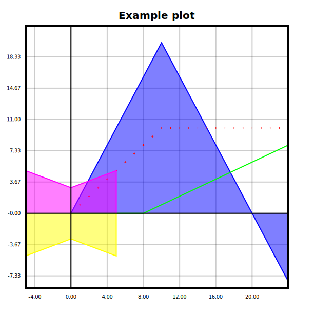
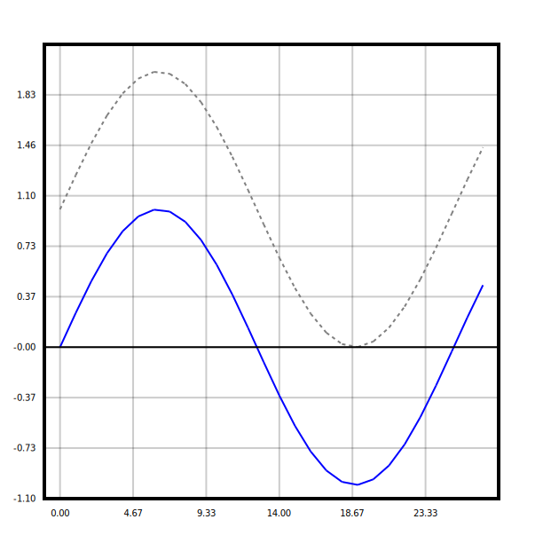
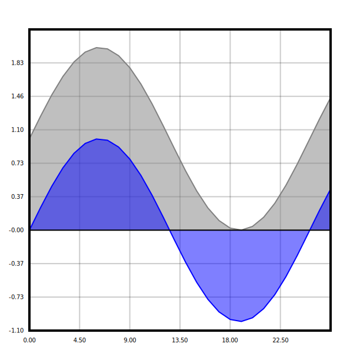
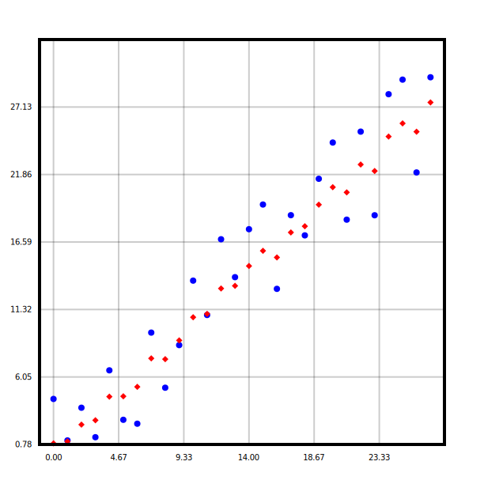
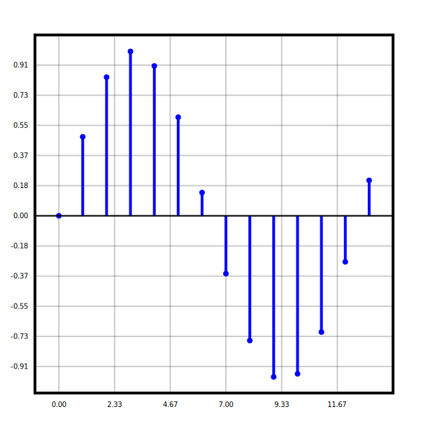
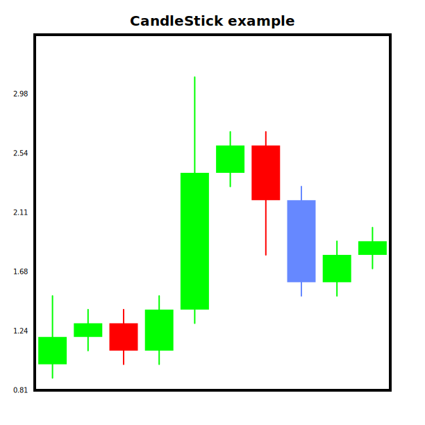

# Zig Plot Lib
> This project is currently stalled as I don't have much time to work on it. Anybody can freely create a PR to add new features and I'll review it; or you can also fork it yourself and add whatever you would like.

The Zig Plot Lib is a library for plotting data in Zig. It is designed to be easy to use and to have a simple API.

**Note:** This library is still in development and is not yet ready for production use.

I'm developping this library with version 0.13.0.

## Installation
You can install the library by adding it to the `build.zig.zon` file, either manually like so:
```zig
.{
    ...
    .dependencies = .{
        .zigplotlib = .{
            .url = "https://github.com/Remy2701/zigplotlib/archive/main.tar.gz",
            .hash = "...",
        }
    }
    ...
}
```

The hash can be found using the builtin command:
```sh
zig fetch https://github.com/Remy2701/zigplotlib/archive/main.tar.gz
```

Or you can also add it automatically like so:
```sh
zig fetch --save https://github.com/Remy2701/zigplotlib/archive/main.tar.gz
```

Then in the `build.zig`, you can add the following:
```zig
const zigplotlib = b.dependency("zigplotlib", .{
    .target = target,
    .optimize = optimize,
});

exe.root_module.addImport("plotlib", zigplotlib.module("zigplotlib"));
```

The name of the module (`plotlib`) can be changed to whatever you want.

Finally in your code you can import the module using the following:
```zig
const plotlib = @import("plotlib");
```

## Example



The above plot was generated with the following code:

```zig
const std = @import("std");

const SVG = @import("svg/SVG.zig");

const Figure = @import("plot/Figure.zig");
const Line = @import("plot/Line.zig");
const Area = @import("plot/Area.zig");
const Scatter = @import("plot/Scatter.zig");

/// The function for the 1st plot (area - blue)
fn f(x: f32) f32 {
    if (x > 10.0) {
        return 20 - (2 * (x - 10.0));
    }
    return 2 * x;
}

/// The function for the 2nd plot (scatter - red)
fn f2(x: f32) f32 {
    if (x > 10.0) {
        return 10.0;
    }
    return x;
}

/// The function for the 3rd plot (line - green)
fn f3(x: f32) f32 {
    if (x < 8.0) {
        return 0.0;
    }
    return 0.5 * (x - 8.0);
}

pub fn main() !void {
    var gpa = std.heap.GeneralPurposeAllocator(.{}){};
    defer _ = gpa.deinit();
    const allocator = gpa.allocator();
    
    var points: [25]f32 = undefined;
    var points2: [25]f32 = undefined;
    var points3: [25]f32 = undefined;
    for (0..25) |i| {
        points[i] = f(@floatFromInt(i));
        points2[i] = f2(@floatFromInt(i));
        points3[i] = f3(@floatFromInt(i));
    }

    var figure = Figure.init(allocator, .{
        .title = .{
            .text = "Example plot",
        },
    });
    defer figure.deinit();

    try figure.addPlot(Area {
        .y = &points,
        .style = .{
            .color = 0x0000FF,
        }
    });
    try figure.addPlot(Scatter {
        .y = &points2,
        .style = .{
            .shape = .plus,
            .color = 0xFF0000,
        }
    });
    try figure.addPlot(Line {
        .y = &points3,
        .style = .{
            .color = 0x00FF00,
        }
    });
    try figure.addPlot(Area {
        .x = &[_]f32 { -5.0, 0.0, 5.0 },
        .y = &[_]f32 { 5.0, 3.0, 5.0 },
        .style = .{
            .color = 0xFF00FF,
        }
    });
    try figure.addPlot(Area {
        .x = &[_]f32 { -5.0, 0.0, 5.0 },
        .y = &[_]f32 { -5.0, -3.0, -5.0 },
        .style = .{
            .color = 0xFFFF00,
        }
    });

    var svg = try figure.show();
    defer svg.deinit();

    // Write to an output file (out.svg)
    var file = try std.fs.cwd().createFile("out.svg", .{});
    defer file.close();

    try svg.writeTo(file.writer());
}
```

## Usage

The first thing needed is to create a figure which will contain the plots.

```zig
const std = @import("std");
const Figure = @import("plot/Figure.zig");

pub fn main() !void {
    var gpa = std.heap.GeneralPurposeAllocator(.{}){};
    defer _ = gpa.deinit();
    const allocator = gpa.allocator();

    var figure = Figure.init(allocator, .{});
    defer figure.deinit();
}
```

The figure takes two arguments, the allocator (used to store the plot and generate the SVG) and the style for the plot. The options available for the style are:

| Option | Type | Description |
| --- | --- | --- |
| `width` | `union(enum) { pixel: f32, auto_gap: f32 }` | The width of the plot in pixels (excluding the axis and label). |
| `height` | `union(enum) { pixel: f32, auto_gap: f32 }` | The height of the plot in pixels (excluding the axis and label). |
| `plot_padding` | `f32` | The padding around the plot |
| `background_color` | `RGB (u48)` | The background color of the plot |
| `background_opacity` | `f32` | The opacity of the background |
| `title` | `?...` | The style of the title (null to hide it) |
| `value_padding` | `...` | The padding to use for the range of the plot |
| `axis` | `...` | The style for the axis |
| `legend` | `...` | The style for the legend |

The `title` option contains the following parameters:
| Option | Type | Description |
| --- | --- | --- |
| `text` | `[]const u8` | The title of the figure |
| `position` | `enum { top, bottom }` | The position of the title |
| `font_size` | `f32` | The font size of the title |
| `color` | `RGB (u48)` | The color of the title |
| `padding` | `f32` | The padding between the plot and the title |

The `value_padding` option is defined like so:
```zig
pub const ValuePercent = union(enum) {
    value: f32,
    percent: f32,
};

value_padding: struct {
    x_max: ValuePercent,
    y_max: ValuePercent,
    x_min: ValuePercent,
    y_min: ValuePercent,
},
```

The `axis` option contains more parameters:

| Option | Type | Description |
| --- | --- | --- |
| `x_scale` | `enum { linear, log }` | The scale of the x axis |
| `y_scale` | `enum { linear, log }` | The scale of the y axis |
| `x_range` | `?Range(f32)` | The range of values for the x axis |
| `y_range` | `?Range(f32)` | The range of values for the y axis |
| `color` | `RGB (u48)` | The color of the axis |
| `width` | `f32` | The width of the axis |
| `label_color` | `RGB (u48)` | The color of the labels |
| `label_size` | `f32` | The font size of the labels |
| `label_padding` | `f32` | The padding between the labels and the axis | 
| `label_font` | `[]const u8` | The font to use for the labels |
| `tick_count_x` | `...` | The number of ticks to use on the x axis |
| `tick_count_y` | `...` | The number of ticks to use on the y axis |
| `show_x_axis` | `bool` | whether to show the x axis |
| `show_y_axis` | `bool` | whether to show the y axis |
| `show_grid_x` | `bool` | whether to show the grid on the x axis |
| `show_grid_y` | `bool` | whether to show the grid on the y axis |
| `grid_opacity` | `f32` | The opacity of the grid |
| `frame_color` | `RGB (u48)` | The color of the frame |
| `frame_width` | `f32` | The width of the frame |

The `tick_count_x` and `tick_count_y` options are defined like so:
```zig
tick_count_x: union(enum) {
    count: usize,
    gap: f32,
}
```

The `legend` option contains more parameters:

| Option | Type | Description |
| --- | --- | --- |
| `show` | `bool` | Whether to show the legend |
| `position` | `enum { top_left, top_right, bottom_left, bottom_right }` | The position of the legend |
| `font_size` | `f32` | The font size of the legend |
| `background_color` | `RGB (u48)` | The background color of the legend |
| `border_color` | `RGB (u48)` | The border color of the legend |
| `border_width` | `f32` | The border width of the legend |
| `padding` | `f32` | The padding around the legend |

Then you can add a plot like so (here is the example with the line plot):

```zig
const Line = @import("plot/Line.zig");
...
figure.addPlot(Line {
    .y = points,
    .style = .{
        .color = 0x0000FF,
    }
});
```

## Supported Plots

There are currently 6 types of plots supported:

### Line



The options for styling the line plot are:

| Option | Type | Description |
| --- | --- | --- |
| `title` | `?[]const u8` | The title of the plot (used for the legend) |
| `color` | `RGB (u48)` | The color of the line |
| `width` | `f32` | The width of the line |
| `dash` | `?f32` | The length of the dash for the line (null means no dash)  |
| `smooth` | `f32` | The smoothing factor for the line plot. It must be in range [0; 1]. (0 means no smoothing). |

### Area



The options for styling the area plot are:

| Option | Type | Description |
| --- | --- | --- |
| `title` | `?[]const u8` | The title of the plot (used for the legend) |
| `color` | `RGB (u48)` | The color of the area |
| `opacity` | `f32` | The opacity of the area |
| `width` | `f32` | The width of the line (above the area) |

### Scatter



The options for styling the scatter plot are:

| Option | Type | Description |
| --- | --- | --- |
| `title` | `?[]const u8` | The title of the plot (used for the legend) |
| `color` | `RGB (u48)` | The color of the points |
| `radius` | `f32` | The radius of the points |
| `shape` | `...` | The shape of the points |

The available shapes are:

| Shape | Description |
| --- | --- |
| `circle` | A circle |
| `circle_outline` | The outline of a circle | 
| `square` | A square |
| `square_outline` | The outline of a square |
| `triangle` | A triangle (facing upwards) |
| `triangle_outline` | The outline of a triangle (facing upwards) |
| `rhombus` | A rhombus |
| `rhombus_outline` | The outline of a rhombus |
| `plus` | A plus sign |
| `plus_outline` | The outline of a plus sign |
| `cross` | A cross |
| `cross_outline` | The outline of a cross |

### Step


The first value of the x and y arrays are used as the starting point of the plot, this means that the step will start from this point. The options for styling the step plot are:

| Option | Type | Description |
| --- | --- | --- |
| `title` | `?[]const u8` | The title of the plot (used for the legend) |
| `color` | `RGB (u48)` | The color of the line |
| `width` | `f32` | The width of the line |

### Stem



The options for styling the stem plot are:

| Option | Type | Description |
| --- | --- | --- |
| `title` | `?[]const u8` | The title of the plot (used for the legend) |
| `color` | `RGB (u48)` | The color of the stem |
| `width` | `f32` | The width of the stem |
| `shape` | `Shape` | The shape of the points (at the end of the stem) |
| `radius` | `f32` | The radius of the points (at the end of the stem) |

### Candlestick



The options for styling the candlestick plot are:

| Option | Type | Description |
| --- | --- | --- |
| `title` | `?[]const u8` | The title of the plot (used for the legend) |
| `inc_color` | `RGB (u48)` | The color of the increasing candlestick |
| `dec_color` | `RGB (u48)` | The color of the decreasing candlestick |
| `width` | `f32` | The width of the candle |
| `gap` | `f32` | The gap between the candles |
| `line_thickness` | `f32` | The thickness of the sticks |

The CandleStick plot works a bit differently, it doesn't take a `[]f32` but a `[]Candle`, named `candles` (there is no value for the x-axis).

The parameters for the candle are as follows:

| Field | Type | Description |
| --- | --- | --- |
| `open` | `f32` | The opening price of the candle |
| `close` | `f32` | The closing price of the candle |
| `high` | `f32` | The highest price of the candle |
| `low` | `f32` | The lowest price of the candle |
| `color` | `?RGB (u48)` | The color of the candle (overrides the default one) |

## Supported Markers
You can add a marker to the plot using the `addMarker` function.
There are currently 2 types of markers supported:

### ShapeMarker
The shape marker allows you to write the plot with a shape.

The options for the shape marker are:

| Option | Type | Description |
| --- | --- | --- |
| `x` | `f32` | The x coordinate of the marker |
| `y` | `f32` | The y coordinate of the marker |
| `shape` | `Shape` | The shape of the marker |
| `size` | `f32` | The size of the marker |
| `color` | `RGB (u48)` | The color of the marker |
| `label` | `?[]const u8` | The label of the marker |
| `label_color` | `?RGB (u48)` | The color of the label (default to the same as the shape) |
| `label_size` | `f32` | The size of the label |
| `label_weight` | `FontWeight` | The weight of the label |


### TextMarker
The Text marker is similar to the shape marker, but there is no shape, only text.

The options for the text marker are:

| Option | Type | Description |
| --- | --- | --- |
| `x` | `f32` | The x coordinate of the marker |
| `y` | `f32` | The y coordinate of the marker |
| `size` | `f32` | The size of the text |
| `color` | `RGB (u48)` | The color of the text |
| `text` | `[]const u8` | The text of the marker |
| `weight` | `FontWeight` | The weight of the text |

## Create a new plot type
In order to create a new type of plot, all that is needed is to create a struct that contains an `interface` function, defined as follows:

```zig
pub fn interface(self: *const Self) Plot {
    ...
}
```

The `Plot` object, contains the following fields:
- a pointer to the data (`*const anyopaque`)
- the title of the plot (`?[]const u8`) (used for the legend)
- the color of the plot (`RGB (u48)`) (used for the legend)
- a pointer to the get_range_x function `*const fn(*const anyopaque) Range(f32)`
- a pointer to the get_range_y function `*const fn(*const anyopaque) Range(f32)`
- a pointer to the draw function `*const fn(*const anyopaque, Allocator, *SVG, FigureInfo) anyerror!void`

You can look at the implementation of the `Line`, `Scatter`, `Area`, `Step`, `Stem`, or `CandleStick` plots for examples.

## Create a new marker type
Same as for the plots, to create a new type of marker, all that is needed is to create a struct that contains an `interface` function, defined as follows:

```zig
pub fn interface(self: *const Self) Marker {
    ...
}
```

The `Marker` object, contains the following fields:
- a pointer to the data (`*const anyopaque`)
- a pointer to the draw function `*const fn(*const anyopaque, Allocator, *SVG, FigureInfo) anyerror!void`

You can look at the implementation of the `ShapeMarker` or `TextMarker` for examples.

## Roadmap
- Ability to set the title of the axis
- Ability to add arrows at the end of axis
- More plot types
    - Bar
    - Histogram
- Linear Interpolation with the figure border
- Themes

### Known issue(s)
- Imperfect text width calculation for the legend (only when the legend is positioned on the right)
